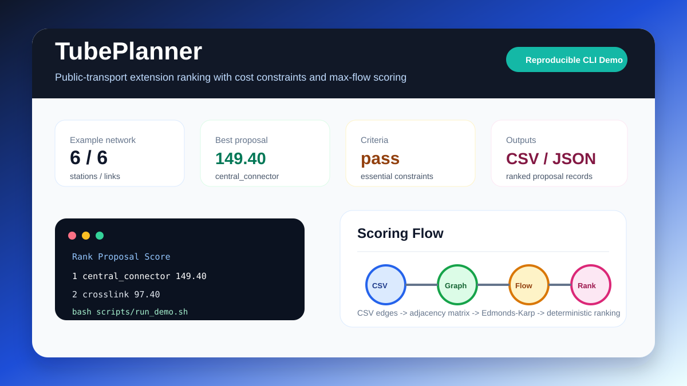

# TubePlanner

[中文](README.md)

TubePlanner evaluates public-transport network extension proposals. It reads a baseline network and candidate extensions from CSV edge tables, then ranks proposals using cost constraints and maximum-flow metrics.



## Features

- Converts stations and connections into graph structures and travel times into capacities.
- Uses BFS and Edmonds-Karp maximum flow to evaluate proposal capacity gains.
- Supports essential criteria, desirable criteria, and fixed-cost configuration.
- Outputs results as text, CSV, or JSON.

## Results

| Item | Result |
| --- | --- |
| Example network | 6 stations, 6 links |
| Top proposal | `central_connector` |
| Proposal score | 149.40 |
| Essential criteria | pass |

Sample output:

```text
Rank  Proposal                   Score  Essential
----------------------------------------------------
1     central_connector         149.40  pass
2     crosslink                  97.40  pass
```

## Quick Start

```bash
bash scripts/setup_env.sh
bash scripts/run_demo.sh
```

Reuse an existing conda environment:

```bash
conda run -n codex_python bash scripts/run_demo.sh
```

Run the CLI:

```bash
python -m tube_planning.evaluation --network-file examples/baseline_network.csv --format csv examples/costs.fixed-cost examples/criteria.cfile "examples/proposals/*.csv"
```

## Requirements

- Python 3.10+
- Dependencies listed in `requirements.txt`

## Data Notes

- `examples/baseline_network.csv` is the baseline network.
- `examples/proposals/` contains candidate extensions.
- `examples/costs.fixed-cost` and `examples/criteria.cfile` contain cost and scoring configuration.

## Project Layout

```text
tube_planning/        Core package
examples/             Example data
tests/                Tests
scripts/              Setup and run scripts
docs/images/          README result image
```

## Tests

```bash
pytest -q
```
